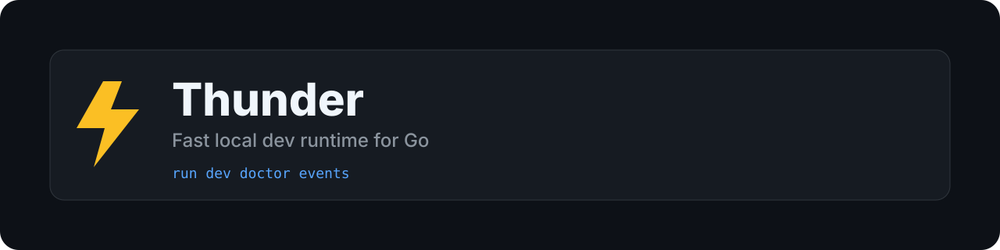

# Thunder

[](https://github.com/Dziqha/Thunder/actions/workflows/ci.yml)
[](https://github.com/Dziqha/Thunder/actions/workflows/release.yml)
[](https://github.com/Dziqha/Thunder/releases)

Fast local dev runtime for Go.

Thunder gives you two modes:
- **`thunder run`** for hot reload in a single Go app
- **`thunder dev`** for multi-service orchestration with dependencies and health checks

## Overview

- hot reload for Go services
- orchestration profiles for local stacks
- dependency health gating
- restart policies with backoff
- event stream for observability
- diagnostics and release checks

## Contents

- [Install](#install)
- [Quick Start](#quick-start)
- [Commands](#commands)
- [Example Config](#example-config)
- [Events](#events)
- [Benchmark Script](#benchmark-script)
- [Docs](#docs)
- [Contributing](#contributing)

## Why Thunder?

- quick Go rebuild/restart loop
- multi-service profiles (`api`, `worker`, `full`, etc.)
- dependency-aware startup
- health checks (`http`, `tcp`)
- restart policy + backoff
- event stream for observability (`json` / `text`)

## Install

```bash
go install github.com/Dziqha/Thunder/cmd/thunder@latest
```

Requirements:
- Go 1.24+

## Quick Start

```bash
thunder init
thunder run
```

For orchestration:

```bash
thunder dev
```

Sanity check:

```bash
thunder doctor
``` 

## Commands

```bash
thunder init
thunder run [package]
thunder dev [profile]
thunder doctor
thunder inspect [profile]
thunder events [profile] [--format=json|text] [--service=name] [--type=prefix] [--out=file] [--also-stdout]
thunder release-check
```

## Example Config

```toml
build_path = "./tmp/main"
main_file = "main.go"
watch_dirs = ["."]
exclude_dirs = ["tmp", "vendor", ".git", "node_modules", ".idea", "bin"]
watch_exts = [".go", ".mod", ".sum", ".env"]
watch_files = ["go.mod", "go.sum", "thunder.toml", ".env"]
debounce = 100

[project]
name = "myapp"
default_profile = "dev"
log_format = "text"

[services.redis]
type = "process"
command = ["docker", "compose", "up", "redis"]

[services.api]
type = "go"
package = "./cmd/api"
depends_on = ["redis"]
env_files = [".env"]
restart_policy = "always"
max_restarts = 5
depends_timeout_ms = 15000

[services.api.healthcheck]
type = "http"
url = "http://localhost:8080/health"
interval_ms = 500
timeout_ms = 3000
retries = 20

[profiles.dev]
services = ["redis", "api"]
```

## Events

```bash
# stream all events as json
thunder events dev --format=json

# only api restart events
thunder events dev --format=json --service=api --type=restart.

# save events to file
thunder events dev --format=json --out=events.log --also-stdout

# rotate log at 10MB, keep 5 files
thunder events dev --format=json --out=events.log --max-size-mb=10 --max-files=5
```

## Benchmark Script

```bash
pwsh ./scripts/bench.ps1 -Iterations 20 -Target ./cmd/thunder -OutJson bench.json -OutMd bench.md
```

Current baseline reports in this repo:
- `docs/bench-baseline.md`
- `docs/bench-baseline.json`

## Project Status

Thunder is production-ready for Go hot reload and profile-based local orchestration.

The project is actively maintained, and backward compatibility is preserved whenever possible.

If you find bugs or rough edges, please open an issue.

## Docs

- `docs/architecture.md`
- `docs/config-reference.md`

## Contributing

PRs are welcome.

Please read `CONTRIBUTING.md` before opening a pull request.

Recommended local checks:

```bash
go test ./...
go test -race ./...
go build ./...
thunder release-check
```
